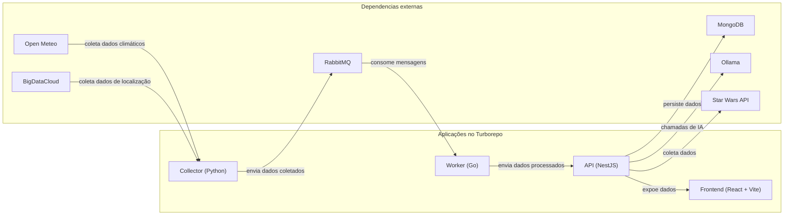

# Weather Dashboard

Dashboard com insights e dados climáticos acerca de determinada região, utilizando um monorepo com collector, worker, api e aplicação web.

## Arquitetura

- Collector (Python): Responsável por buscar periodicamente os dados climáticos da Open Meteo e Big Data Cloud, tratar os dados brutos em formato JSON e publicar as mensagens na fila do RabbitMQ para processamento assíncrono.
- Worker (Go): Serviço intermediário que consome as mensagens do RabbitMQ, valida e transforma os dados quando necessário, aplica regras básicas de negócio e realiza o envio estruturado para a API via requisições HTTP.
- API (NestJS): Recebe os dados processados pelo Worker, armazena no MongoDB, integra com o Ollama para geração de insights por IA, gerencia usuários com autenticação, consome a Star Wars API para a funcionalidade de paginação externa e disponibiliza endpoints de consulta, exportação e integração com o frontend.
- Frontend (React + Vite): Interface do usuário que consome a API para exibir dashboard climático, gráficos históricos, insights de IA, exportação de dados, telas de autenticação e gerenciamento de usuários, além da página de listagem e detalhes integrados com os dados da Star Wars API via backend.



## Instalação local

### Pré-requisitos

Instalar [docker](https://www.docker.com/products/docker-desktop/).

### Passo a passo

1. Clone o repositório:

```bash
git clone <repository-url>
```

2. Navegue até o repositório:

```bash
cd <project-directory>
```

3. Rode o docker compose:

```bash
docker compose up
```

4. Acesse o dashboard em http://localhost:8080. Também é possível acessar a documentação através do http://localhost:3000/api e também acessar o RabbitMQ Management UI através do http://localhost:15672.

### (Opcional) Utilizar GPU para gerar insights

Caso possua uma GPU da Nvidia, descomente as linhas do docker compose para uma geração mais rápida de insights:

```yml
# ===== DESCOMENTAR SE TIVER GPU DA NVIDIA =====
runtime: nvidia
deploy:
  resources:
    reservations:
      devices:
        - capabilities: [gpu]
environment:
  - OLLAMA_GPU_LAYER=1000
```

</details>

## Licença

Código lançado sobre a licença [GNU Affero General Public License V3](LICENSE).
